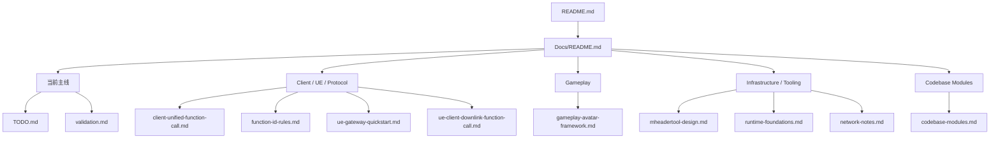

# 📚 Docs

`Docs/` 是 Mession 唯一的正式文档目录。  
这里的文档分三类：

- 架构与阶段决策
- 协议与开发流程
- 源码模块说明

## 🗺️ 文档地图

## 🚶 推荐阅读路径

### 1️⃣ 路线 1：理解当前主链路

1. [client-unified-function-call.md](/workspaces/Mession/Docs/client-unified-function-call.md)
2. [function-id-rules.md](/workspaces/Mession/Docs/function-id-rules.md)
3. [validation.md](/workspaces/Mession/Docs/validation.md)
4. [TODO.md](/workspaces/Mession/Docs/TODO.md)

### 2️⃣ 路线 2：理解 Gameplay 方向

1. [gameplay-avatar-framework.md](/workspaces/Mession/Docs/gameplay-avatar-framework.md)
2. [ue-gateway-quickstart.md](/workspaces/Mession/Docs/ue-gateway-quickstart.md)
3. [ue-client-downlink-function-call.md](/workspaces/Mession/Docs/ue-client-downlink-function-call.md)

### 3️⃣ 路线 3：理解底层设施

1. [mheadertool-design.md](/workspaces/Mession/Docs/mheadertool-design.md)
2. [runtime-foundations.md](/workspaces/Mession/Docs/runtime-foundations.md)
3. [network-notes.md](/workspaces/Mession/Docs/network-notes.md)

## 🧾 文档索引

### 当前主线

- [TODO.md](/workspaces/Mession/Docs/TODO.md)
- [validation.md](/workspaces/Mession/Docs/validation.md)

### Client / UE / Protocol

- [client-unified-function-call.md](/workspaces/Mession/Docs/client-unified-function-call.md)
- [function-id-rules.md](/workspaces/Mession/Docs/function-id-rules.md)
- [ue-gateway-quickstart.md](/workspaces/Mession/Docs/ue-gateway-quickstart.md)
- [ue-client-downlink-function-call.md](/workspaces/Mession/Docs/ue-client-downlink-function-call.md)

### Gameplay

- [gameplay-avatar-framework.md](/workspaces/Mession/Docs/gameplay-avatar-framework.md)

### Infrastructure / Tooling

- [mheadertool-design.md](/workspaces/Mession/Docs/mheadertool-design.md)
- [runtime-foundations.md](/workspaces/Mession/Docs/runtime-foundations.md)
- [network-notes.md](/workspaces/Mession/Docs/network-notes.md)
- [logging-design.md](/workspaces/Mession/Docs/logging-design.md)

### Codebase Modules

- [codebase-modules.md](/workspaces/Mession/Docs/codebase-modules.md)

## 🧼 维护原则

- 根 `README.md`
  - 只放总览和快速开始

- `Docs/`
  - 放正式设计、约束和模块说明

如果两份文档冲突，以 `Docs/` 中更具体的文档为准。
