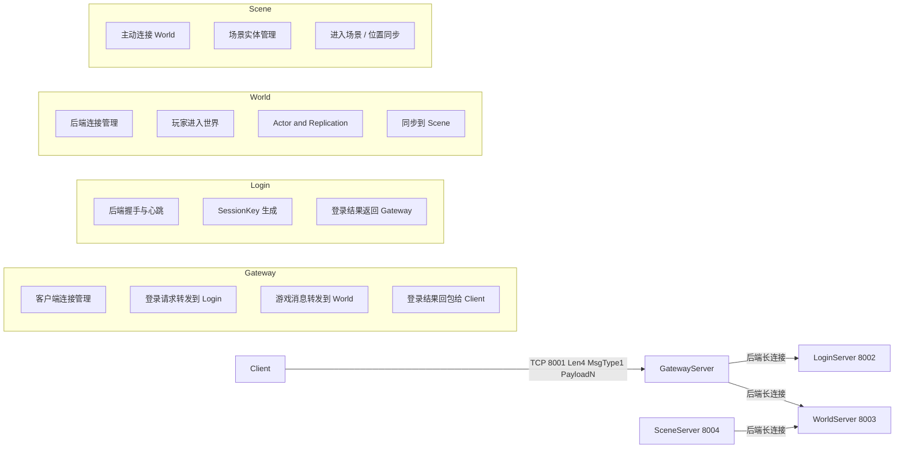
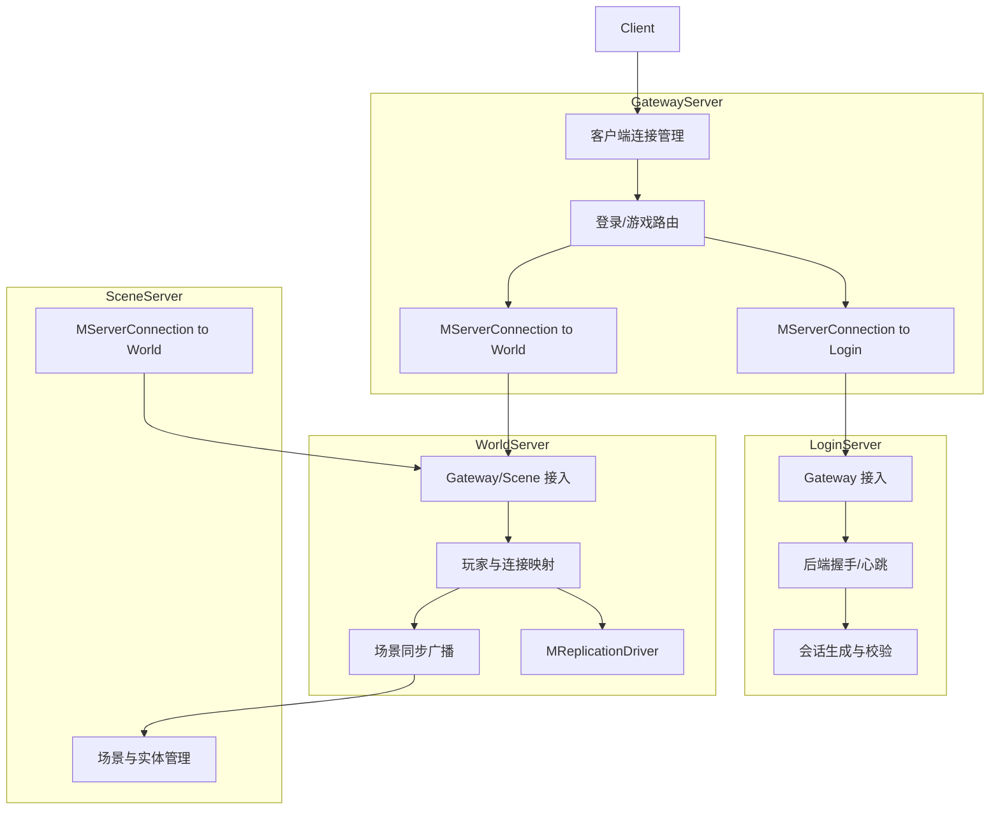
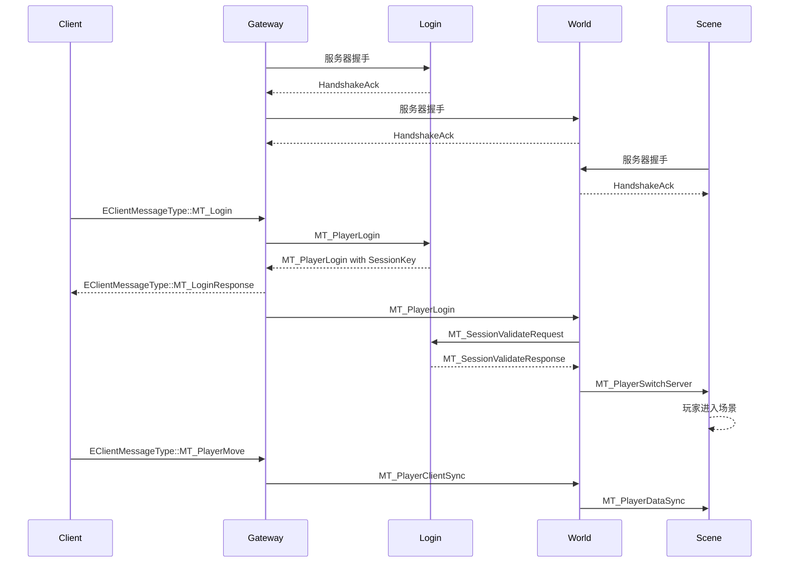
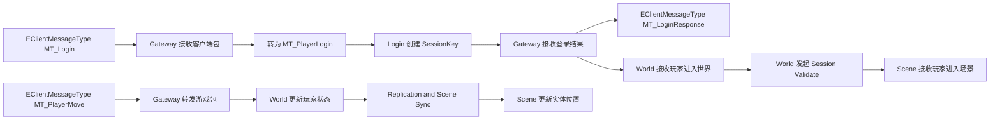
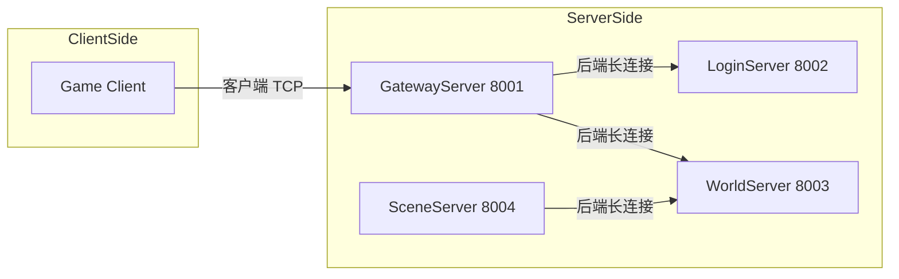
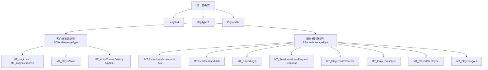
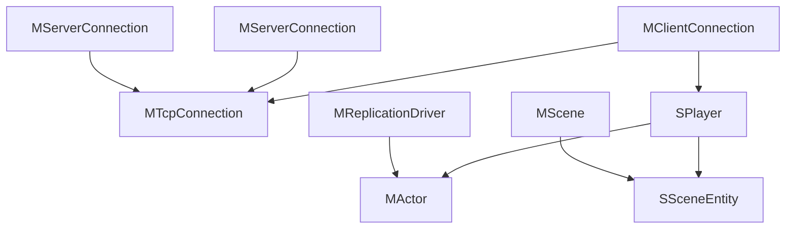

# 🎮 Mession 分布式MMO游戏服务器框架

基于C++20的分布式游戏服务器框架，支持多服务器架构、长连接通信、属性复制等核心功能。

## 📚 文档导航

- 总览文档：当前文件 `README.md`
- 分模块文档索引：`Readme/README.md`
- Router 模块文档：`Readme/router.md`
- 详细设计、架构演进：`Docs/` 目录
- 脚本与使用说明：`Scripts/README.md`

## 📁 项目结构（重构后）

```text
Mession/
├── Source/                    # 所有 C++ 源码
│   ├── Core/                  # 核心库（再拆为 Event / Concurrency / Containers / Net）
│   │   ├── Event/             # 事件循环：EventLoop, MEventLoop, TaskEventLoop, IEventLoopStep
│   │   ├── Concurrency/       # 并发与任务：ThreadPool, TaskQueue, Async, Promise, ITaskRunner
│   │   ├── Containers/        # 自定义容器：RingBuffer 等
│   │   └── Net/               # 网络基础：NetCore, Socket, SocketPlatform, PacketCodec, Poll
│   ├── Common/                # 公共组件：Logger, Config, MessageUtils, ServerConnection 等
│   ├── NetDriver/             # 网络驱动：NetObject, Replicate, ReplicationDriver, Reflection*
│   ├── Messages/              # 统一消息枚举：NetMessages
│   └── Servers/               # 具体服务器实现
│       ├── Gateway/           # 网关服务器 (端口 8001)
│       ├── Login/             # 登录服务器 (端口 8002)
│       ├── World/             # 世界服务器 (端口 8003)
│       ├── Scene/             # 场景服务器 (端口 8004)
│       └── Router/            # 控制面 Router 服务器 (端口 8005)
├── Docs/                      # 架构设计、事件循环、协议、日志等文档
├── Scripts/                   # 一键起服、验证、测试客户端等脚本
├── Config/                    # 服务器配置文件
├── Build/                     # CMake 构建目录（中间文件，可 gitignore）
├── Bin/                       # 编译生成的可执行文件与库
└── CMakeLists.txt             # 构建配置
```

## 🏗️ 当前架构



### 模块关系图



### 典型时序



### 数据流图



### 部署视图



### 网络协议视图



### 运行时对象视图



## 🚀 快速开始

### 编译

```bash
cd Mession
cmake -S . -B Build
cmake --build Build -j4
```

### 运行

```bash
# 启动各个服务器（分开终端，建议先起 Router 再起其余）
./Bin/RouterServer   # 端口 8005
./Bin/LoginServer    # 端口 8002
./Bin/WorldServer    # 端口 8003
./Bin/SceneServer    # 端口 8004
./Bin/GatewayServer  # 端口 8001
```

### 一键起服 / 停服

```bash
# 起服（按序启动五服并等待端口就绪）
python3 Scripts/servers.py start [--build-dir Build]

# 停服（按启动时记录的 PID 结束；Linux 下会再按端口 8001–8005 清理占用）
python3 Scripts/servers.py stop [--build-dir Build]
```

起服顺序：Router(8005) → Login(8002) → World(8003) → Scene(8004) → Gateway(8001)。停服需与起服使用相同 `--build-dir`，否则可手动结束占用端口进程。

### 主链路验证（脚本，不引入 ctest）

在仓库根目录执行：

```bash
python3 Scripts/validate.py [--build-dir Build] [--timeout 50] [--no-build]
```

- 会编译（除非 `--no-build`）、按序启动 Router → Login → World → Scene → Gateway，并执行：**Test 1** 多玩家登录、**Test 2** 复制链路（至少收到 `MT_ActorCreate`）、**Test 3** 断线重连与清理路径。
- **前置条件**：端口 **8001–8005** 未被占用。若被占用，可先结束占用进程（例如 `fuser -k 8001/tcp` 等）再运行。
- CI 中在 Linux GCC 构建后自动执行该脚本（见 `.github/workflows/cmake-multi-platform.yml`）。

## 🎯 核心功能

| 功能 | 说明 |
|------|------|
| **分布式架构** | Gateway/Login/World/Scene 多服务器架构 |
| **长连接** | TCP长连接、自动重连、心跳保活 |
| **属性复制** | UE风格的网络对象复制系统 |
| **AOI区域** | Area of Interest 区域感知系统 |
| **消息协议** | 二进制协议、粘包处理 |

## 🧩 模块职责

- **GatewayServer**: 客户端入口，维护客户端连接，并负责按 `EClientMessageType` 把登录和游戏消息分别转发到 Login / World。
- **LoginServer**: 处理登录请求、生成 `SessionKey`、返回登录结果。
- **WorldServer**: 管理玩家与世界状态，维护 `MActor`，并把玩家进入场景和位置变化同步给 Scene。
- **SceneServer**: 主动连接 World，维护场景内实体视图，处理进场和位置更新。
- **ServerConnection**: 封装服务器间长连接、握手、心跳和业务消息分发。
- **Socket / MTcpConnection**: 统一底层 TCP 包收发，处理半包、粘包和非阻塞发送。

## 🧭 RouterServer 设计

- 当前更适合引入一个**控制面 RouterServer**，统一做服务注册、心跳、健康检查和路由查询，而不是把高频业务流量都中转过去。
- `Gateway / Login / World / Scene` 仍然保持业务直连，`RouterServer` 只回答“该连谁”以及“谁还活着”。
- 这样既能消掉硬编码地址，也不会把 `MT_PlayerClientSync`、`MT_PlayerDataSync`、复制消息和移动同步压到一个新的热点节点。
- 详细设计与当前实现说明见 `Readme/router.md`。

### 关键消息职责

- **客户端登录包 `EClientMessageType::MT_Login`**: 由 `GatewayServer` 接收，转成后端 `MT_PlayerLogin` 发给 `LoginServer`。
- **客户端登录响应 `EClientMessageType::MT_LoginResponse`**: 由 `GatewayServer` 回给客户端，负载为 `SessionKey + PlayerId`。
- **客户端移动消息 `EClientMessageType::MT_PlayerMove`**: 由 `GatewayServer` 转发到 `WorldServer`，再同步给场景服。
- **`MT_PlayerLogin`**: `LoginServer` 用它生成 `SessionKey`；`GatewayServer` 再把成功结果同步给 `WorldServer`。
- **`MT_SessionValidateRequest / MT_SessionValidateResponse`**: `WorldServer` 进入业务前向 `LoginServer` 校验 `SessionKey`。
- **`MT_PlayerSwitchServer`**: 由 `WorldServer` 发给 `SceneServer`，表示玩家进入某个场景。
- **`MT_PlayerClientSync`**: 用于 `Gateway -> World` 的客户端业务包转发，以及 `World -> Gateway` 的按 `PlayerId` 回程复制转发。
- **`MT_PlayerDataSync`**: 用于 `World -> Scene` 的位置/状态同步。
- **握手/心跳消息**: 全部走 `ServerConnection`，用于后端长连接认证和保活，不进入业务层消息分发。

### 三层理解

- **部署视图**: 看清楚进程和端口分别是谁对谁连。
- **网络协议视图**: 看清楚统一包格式和服务器间消息类型是怎么分层的。
- **运行时对象视图**: 看清楚连接、玩家、Actor、Scene 实体在内存中的核心关系。

## 📦 包格式

- **客户端 <-> Gateway / 服务端 MTcpConnection**: `Length(4) + MsgType(1) + Payload(N)`
- **服务器 <-> 服务器**: 同样使用 `Length(4) + MsgType(1) + Payload(N)`，其中 `MsgType` 由 `EServerMessageType` 定义
- **客户端消息枚举**: `MsgType` 由 `EClientMessageType` 定义
- **握手消息**: `ServerId(4) + ServerType(1) + NameLen(2) + ServerName`
- **登录结果**: `MsgType(1) + SessionKey(4) + PlayerId(8)`

### 客户端消息枚举

| 枚举 | 值 | 用途 |
|------|----|------|
| `EClientMessageType::MT_Login` | `1` | 客户端登录请求 |
| `EClientMessageType::MT_LoginResponse` | `2` | 登录成功响应，返回 `SessionKey + PlayerId` |
| `EClientMessageType::MT_Handshake` | `3` | 客户端握手或兼容旧登录入口 |
| `EClientMessageType::MT_PlayerMove` | `5` | 玩家移动输入 |
| `EClientMessageType::MT_ActorCreate` | `6` | 服务端下发 Actor 创建 |
| `EClientMessageType::MT_ActorDestroy` | `7` | 服务端下发 Actor 销毁 |
| `EClientMessageType::MT_ActorUpdate` | `8` | 服务端下发 Actor 属性同步 |

### 跨服消息枚举

| 枚举 | 用途 |
|------|------|
| `MT_ServerHandshake / MT_ServerHandshakeAck` | 后端连接认证 |
| `MT_Heartbeat / MT_HeartbeatAck` | 后端保活 |
| `MT_PlayerLogin` | Gateway 请求登录，或把登录结果同步给 World |
| `MT_SessionValidateRequest / MT_SessionValidateResponse` | World 向 Login 校验 `SessionKey` |
| `MT_PlayerSwitchServer` | World 通知 Scene 玩家进入场景 |
| `MT_PlayerClientSync` | Gateway 到 World 的客户端数据转发，以及 World 到 Gateway 的按 `PlayerId` 回程转发 |
| `MT_PlayerDataSync` | World 到 Scene 的状态同步 |
| `MT_PlayerLogout` | 玩家离线或离场通知 |

## 📡 服务器间通信

```cpp
#include "Common/ServerConnection.h"

// 设置本服务器信息
MServerConnection::SetLocalInfo(1, EServerType::Gateway, "Gateway01");

// 添加远程服务器连接
auto Conn = Manager->AddServer(2, EServerType::Login, "Login01", "127.0.0.1", 8002);

// 设置回调
Conn->SetOnAuthenticated([](auto Conn, const SServerInfo& Info) {
    LOG_INFO("Server %s authenticated!", Info.ServerName.c_str());
});

// 连接
Conn->Connect();

// 发送消息
Conn->SendPlayerLogin(12345, 999999);
```

## 🔧 技术栈

- **语言**: C++20
- **构建**: CMake
- **网络**: epoll/poll, TCP
- **协议**: 自定义二进制协议

## 📝 许可证

MIT License
