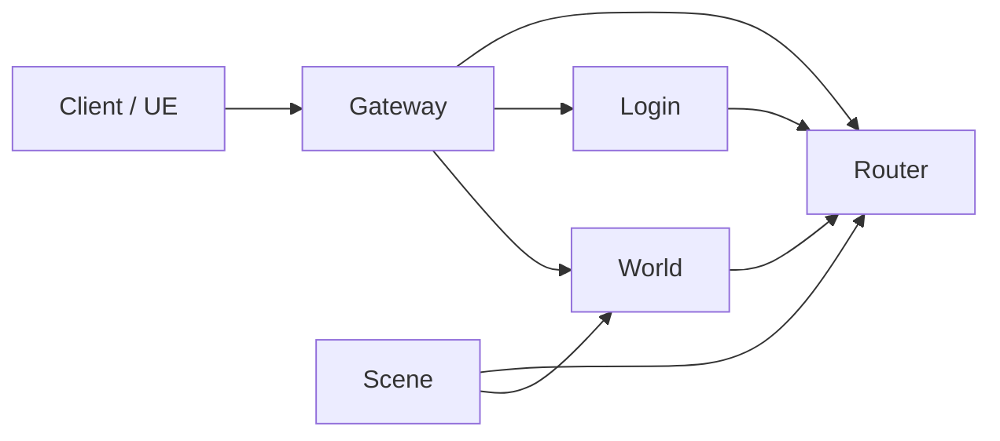
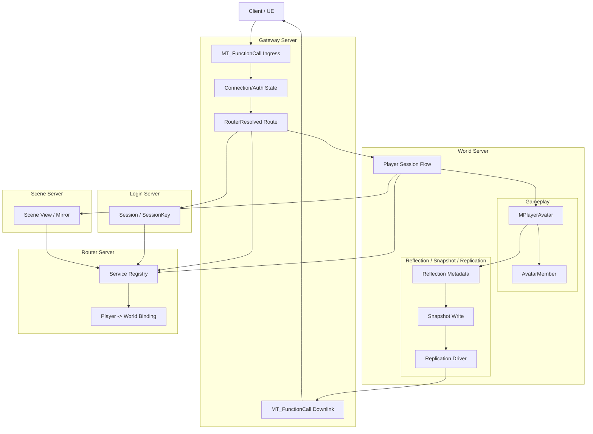
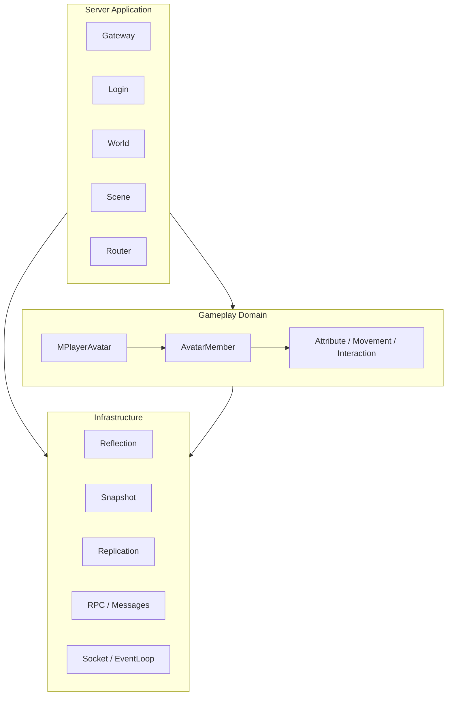
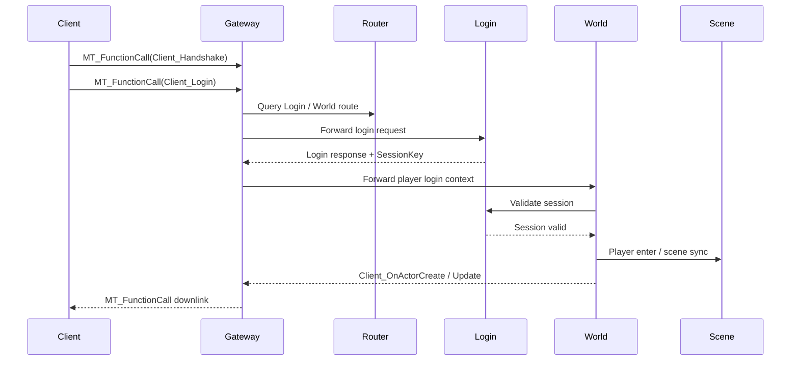

# Mession

Mession 是一个基于 C++20 的分布式游戏服务器项目。  
当前已经跑通并持续验证的主链路是：

```text
Client -> Gateway -> Router -> Login / World / Scene
```

项目当前关注的不是继续堆样例功能，而是把这几件事做稳：

- 客户端统一函数调用入口
- Gateway 路由与转发边界
- World 侧 Avatar / Gameplay 骨架
- 反射驱动的 snapshot / replication
- 自动化验证与回归基线

## 🏗️ 当前架构

建议把仓库理解成三层：

```text
Server Application
  -> Gateway / Login / World / Scene / Router 的流程编排

Gameplay Domain
  -> Avatar / Member / Attribute / Interaction 等领域模型

Infrastructure
  -> Reflection / Snapshot / Replication / RPC / Message / Socket / EventLoop
```

其中：

- `Server` 决定流程、路由和调度
- `Gameplay` 决定对象、状态和规则
- `Infrastructure` 决定同步、持久化和传输

### 🌐 服务拓扑



### 🧭 当前架构图



### 🎯 下一步目标图

```mermaid
flowchart TB
    subgraph WorldServer["World Server"]
        Session[PlayerSession]

        subgraph Gameplay["Gameplay Domain"]
            Avatar[MPlayerAvatar]
            Member[AvatarMember]
            Property[MPROPERTY(PersistentData, RepToClient)]
        end

        subgraph Runtime["Runtime State"]
            Dirty[Per-Domain Dirty Tracking]
            ClientDirty[Client Dirty Domain]
            PersistentDirty[Persistent Dirty Domain]
        end

        subgraph Infra["Infrastructure"]
            Reflection[Reflection Metadata]
            Snapshot[Snapshot / Replication Export]
            Replication[Replication Subsystem]
            Persistence[Persistence Subsystem]
        end
    end

    Session --> Avatar
    Avatar --> Member
    Avatar --> Property
    Property --> Reflection
    Property --> Dirty
    Dirty --> ClientDirty
    Dirty --> PersistentDirty
    Reflection --> Snapshot
    ClientDirty --> Replication
    Snapshot --> Replication
    PersistentDirty --> Persistence
```

这张图表达的目标是：

- `Avatar` 仍然是运行时对象
- 字段通过元数据声明属于哪些同步域
- 属性修改后只标记 dirty
- `Replication` 和 `Persistence` 各自消费自己的 dirty 域
- 不把“改字段 -> 立刻写库 / 立刻发包”硬编码在业务对象里

### 🧱 分层关系



### 🔄 主链路时序



## 📚 文档入口

仓库只保留一套正式文档目录：`Docs/`。

第一次阅读建议按下面顺序：

1. 当前文件 `README.md`
2. [Docs/README.md](/workspaces/Mession/Docs/README.md)
3. [Docs/client-unified-function-call.md](/workspaces/Mession/Docs/client-unified-function-call.md)
4. [Docs/gameplay-avatar-framework.md](/workspaces/Mession/Docs/gameplay-avatar-framework.md)
5. [Docs/validation.md](/workspaces/Mession/Docs/validation.md)

## 📁 仓库结构

```text
Mession/
├── Source/
│   ├── Core/          # 事件循环、并发、网络基础
│   ├── Common/        # 公共类型、日志、配置、消息工具
│   ├── Messages/      # 消息枚举与协议边界
│   ├── NetDriver/     # 反射、snapshot、replication
│   ├── Gameplay/      # Avatar / Member 等领域模型
│   ├── Servers/       # Gateway / Login / World / Scene / Router
│   └── Tools/         # 代码生成与调试工具
├── Docs/              # 正式设计、模块说明、流程文档
├── Scripts/           # 起服、验证、协议检查脚本
├── Config/            # 配置文件
├── Bin/               # 构建产物
├── Build/             # CMake 构建目录
└── CMakeLists.txt
```

## 🚀 快速开始

### 🔧 构建

```bash
cmake -S . -B Build -DCMAKE_BUILD_TYPE=Release
cmake --build Build -j4
```

### ✅ 运行主链路验证

```bash
python3 Scripts/validate.py --timeout 60
```

如果只想重跑验证：

```bash
python3 Scripts/validate.py --timeout 60 --no-build
```

### ▶️ 只启动服务

```bash
python3 Scripts/servers.py start
python3 Scripts/servers.py stop
```

脚本说明见 [Scripts/README.md](/workspaces/Mession/Scripts/README.md)。

## 📌 当前重点文档

- 客户端与 UE 接入
  - [Docs/client-unified-function-call.md](/workspaces/Mession/Docs/client-unified-function-call.md)
  - [Docs/function-id-rules.md](/workspaces/Mession/Docs/function-id-rules.md)
  - [Docs/ue-gateway-quickstart.md](/workspaces/Mession/Docs/ue-gateway-quickstart.md)
  - [Docs/ue-client-downlink-function-call.md](/workspaces/Mession/Docs/ue-client-downlink-function-call.md)

- Gameplay 方向
  - [Docs/gameplay-avatar-framework.md](/workspaces/Mession/Docs/gameplay-avatar-framework.md)

- 开发与回归
  - [Docs/validation.md](/workspaces/Mession/Docs/validation.md)
  - [Docs/TODO.md](/workspaces/Mession/Docs/TODO.md)

## 💡 当前建议

如果接下来继续推进项目，优先顺序建议是：

1. 先确认 `Docs/README.md` 里的文档地图
2. 再确认 `Docs/gameplay-avatar-framework.md` 里的分层原则
3. 然后推进字段域与 dirty 域这类真正影响业务架构的骨架

当前不建议优先做的事情：

- 继续扩样例对象
- 把更多业务直接塞进 `WorldServer`
- 为兼容历史路径继续扩手写消息分支
