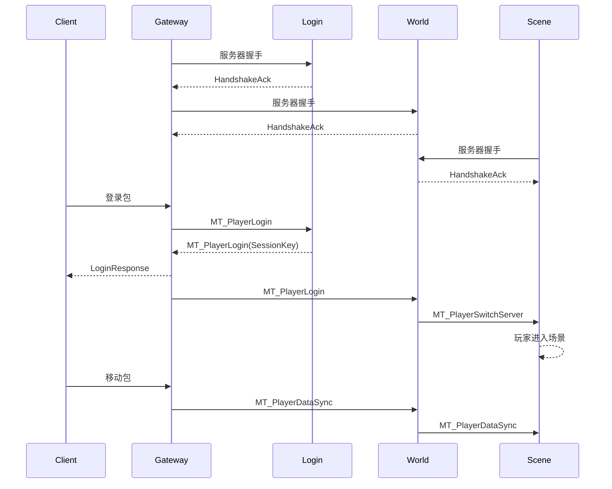

# 🎮 Mession 分布式MMO游戏服务器框架

基于C++20的分布式游戏服务器框架，支持多服务器架构、长连接通信、属性复制等核心功能。

## 📁 项目结构

```
Mession/
├── Core/                      # 核心库
│   ├── NetCore.h            # 基础类型定义
│   └── Socket.cpp/h         # 网络Socket封装
├── Common/                   # 公共组件
│   ├── Logger.h             # 日志系统
│   └── ServerConnection.h   # 服务器长连接抽象层
├── NetDriver/               # 网络驱动
│   ├── NetObject.h         # MObject/MActor 运行时网络对象
│   ├── Replicate.h        # 属性复制系统
│   └── ReplicationDriver.h # 复制驱动
├── Servers/                 # 服务器实现
│   ├── Gateway/            # 网关服务器 (端口8001)
│   ├── Login/              # 登录服务器 (端口8002)
│   ├── World/              # 世界服务器 (端口8003)
│   └── Scene/              # 场景服务器 (端口8004)
└── CMakeLists.txt          # 构建配置
```

## 🏗️ 当前架构

```mermaid
flowchart LR
    C[Client] -->|TCP :8001\nLength(4) + MsgType(1) + Payload| G[GatewayServer]

    G -->|长连接 / 后端协议| L[LoginServer :8002]
    G -->|长连接 / 后端协议| W[WorldServer :8003]
    S[SceneServer :8004] -->|长连接 / 后端协议| W

    subgraph Gateway
        G1[客户端连接管理]
        G2[登录请求转发到 Login]
        G3[游戏消息转发到 World]
        G4[登录结果回包给 Client]
    end

    subgraph Login
        L1[后端握手与心跳]
        L2[SessionKey 生成]
        L3[登录结果返回 Gateway]
    end

    subgraph World
        W1[后端连接管理]
        W2[玩家进入世界]
        W3[Actor / Replication]
        W4[同步到 Scene]
    end

    subgraph Scene
        S1[主动连接 World]
        S2[场景实体管理]
        S3[进入场景 / 位置同步]
    end
```

### 典型时序



## 🚀 快速开始

### 编译

```bash
cd Mession
mkdir build && cd build
cmake ..
make -j4
```

### 运行

```bash
# 启动各个服务器（分开终端）
./GatewayServer   # 端口8001
./LoginServer     # 端口8002
./WorldServer    # 端口8003
./SceneServer    # 端口8004
```

## 🎯 核心功能

| 功能 | 说明 |
|------|------|
| **分布式架构** | Gateway/Login/World/Scene 多服务器架构 |
| **长连接** | TCP长连接、自动重连、心跳保活 |
| **属性复制** | UE风格的网络对象复制系统 |
| **AOI区域** | Area of Interest 区域感知系统 |
| **消息协议** | 二进制协议、粘包处理 |

## 🧩 模块职责

- **GatewayServer**: 客户端入口，维护客户端连接，并负责把登录和游戏消息分别转发到 Login / World。
- **LoginServer**: 处理登录请求、生成 `SessionKey`、返回登录结果。
- **WorldServer**: 管理玩家与世界状态，维护 `MActor`，并把玩家进入场景和位置变化同步给 Scene。
- **SceneServer**: 主动连接 World，维护场景内实体视图，处理进场和位置更新。
- **ServerConnection**: 封装服务器间长连接、握手、心跳和业务消息分发。
- **Socket / MTcpConnection**: 统一底层 TCP 包收发，处理半包、粘包和非阻塞发送。

## 📦 包格式

- **客户端 <-> Gateway / 服务端 MTcpConnection**: `Length(4) + MsgType(1) + Payload(N)`
- **服务器 <-> 服务器**: 同样使用 `Length(4) + MsgType(1) + Payload(N)`，其中 `MsgType` 由 `EServerMessageType` 定义
- **握手消息**: `ServerId(4) + ServerType(1) + NameLen(2) + ServerName`
- **登录结果**: `MsgType(1) + SessionKey(4) + PlayerId(8)`

## 📡 服务器间通信

```cpp
#include "Common/ServerConnection.h"

// 设置本服务器信息
MServerConnection::SetLocalInfo(1, EServerType::Gateway, "Gateway01");

// 添加远程服务器连接
auto Conn = Manager->AddServer(2, EServerType::Login, "Login01", "127.0.0.1", 8002);

// 设置回调
Conn->SetOnAuthenticated([](auto Conn, const SServerInfo& Info) {
    LOG_INFO("Server %s authenticated!", Info.ServerName.c_str());
});

// 连接
Conn->Connect();

// 发送消息
Conn->SendPlayerLogin(12345, 999999);
```

## 🔧 技术栈

- **语言**: C++20
- **构建**: CMake
- **网络**: epoll/poll, TCP
- **协议**: 自定义二进制协议

## 📝 许可证

MIT License
