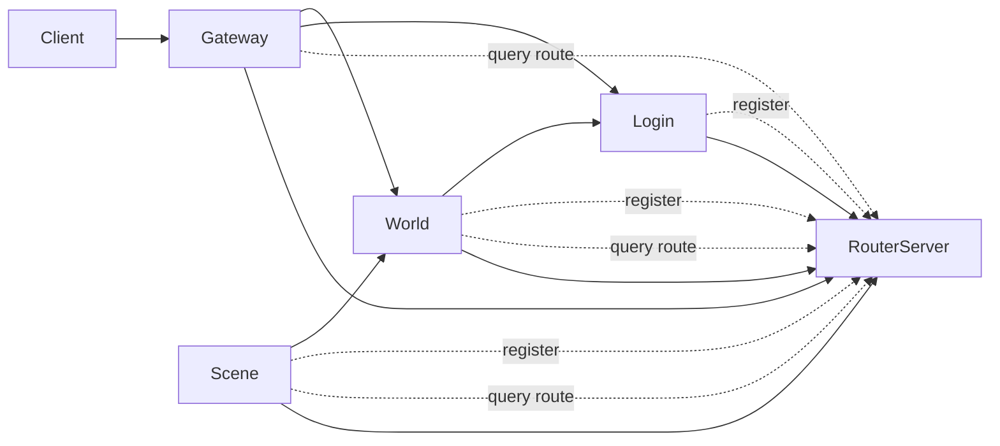
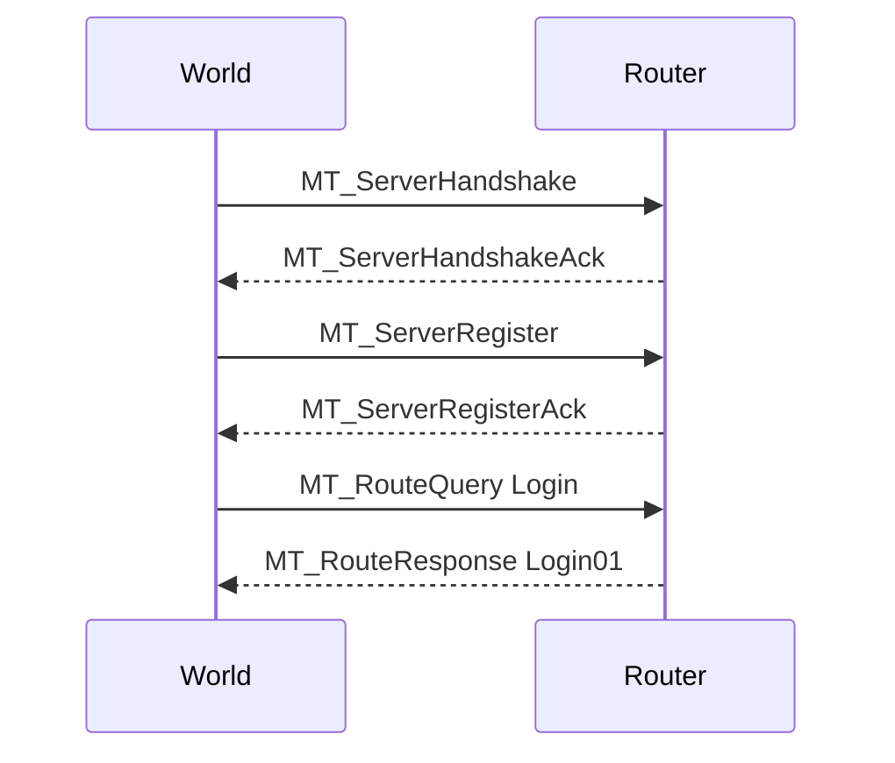
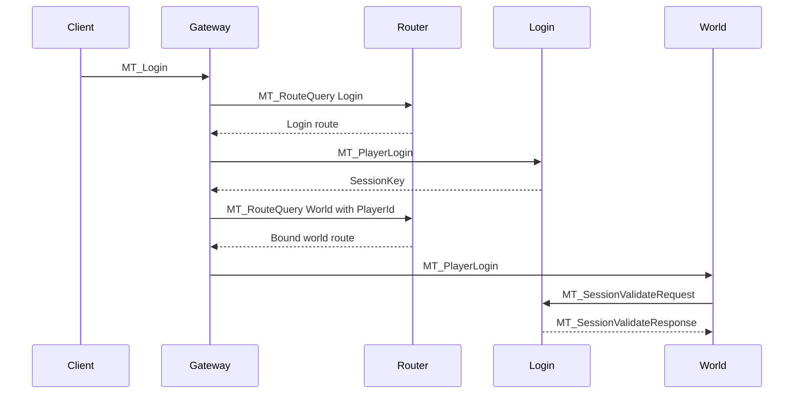

# Router 模块

## 作用

`RouterServer` 是当前系统中的控制面服务，用来做后端发现和选路。

它的目标不是替代 `GatewayServer`，也不是去承载高频业务中转，而是把这些能力集中出来：

- 服务注册
- 健康状态维护
- 路由查询
- 玩家到世界服的稳定绑定
- 后端拓扑的集中视图

## 设计目标

引入 `RouterServer` 主要是为了解决这些问题：

- `Gateway / World / Scene` 的后端地址原本是硬编码的
- 没有统一的服务健康视图
- `Gateway` 无法自然扩展到多个 `World` 或多个 `Scene`
- 未来跨机器、跨网段部署时，静态直连会越来越难维护

## 非目标

当前阶段，`RouterServer` 明确不做这些事：

- 不做通用 TCP 字节流转发
- 不替代 `GatewayServer` 的客户端入口职责
- 不拥有玩家运行时业务状态
- 不接管高频移动、复制和 AOI 流量

也就是说，它是**控制面**，不是**全流量代理**。

## 架构位置

### 目标关系

关键点是：

- `RouterServer` 负责回答“谁可用、该连谁”
- 业务流量仍然由服务之间直连

## 当前已经实现的能力

### 服务注册

以下服务已经会向 `RouterServer` 注册：

- `GatewayServer`
- `LoginServer`
- `WorldServer`
- `SceneServer`

当前注册字段至少包括：

- `ServerId`
- `ServerType`
- `ServerName`
- `Address`
- `Port`

### 路由查询

当前已经支持这些查询：

- `Gateway -> Login`
- `Gateway -> World`
- `World -> Login`
- `Scene -> World`

### 玩家世界服绑定

当 `Gateway` 为某个玩家查询世界服时，会把 `PlayerId` 一并发给 `RouterServer`。

`RouterServer` 当前会：

1. 如果玩家已有世界服绑定，直接返回原目标
2. 如果没有绑定，选择一个可用 `WorldServer`
3. 记录 `PlayerId -> WorldServerId`

这保证同一个玩家可以稳定落到同一个 `WorldServer`。

## 当前边界

`RouterServer` 目前不转发这些消息：

- `MT_PlayerDataSync`
- `MT_PlayerSwitchServer`
- 复制消息
- 移动同步热点流量

这些都继续保持业务直连。

## 核心职责

### 1. 服务注册

每个后端服务启动后向 `RouterServer` 注册自身元信息。

未来可以继续扩展：

- `ZoneId`
- `SceneId`
- `Capacity`
- `CurrentLoad`
- 标签和能力位

### 2. 健康检查

当前依赖已有长连接模型实现：

- 长连接在线状态
- 心跳保活
- 断开后自动从可路由集合中移除

### 3. 路由查询

`RouterServer` 负责根据服务类型和可选的 `PlayerId` 返回目标服务。

当前最主要的查询是：

- 登录服务发现
- 世界服发现
- 玩家到世界服的稳定路由

### 4. 拓扑视图

虽然当前实现还比较轻量，但它已经为后续的拓扑管理留出了清晰位置，例如：

- 哪个 `SceneServer` 属于哪个 `WorldServer`
- 哪个 `WorldServer` 服务哪个区
- 哪个 `LoginServer` 是当前主用实例

## 关键协议

当前 Router 控制面已经使用这些消息：

| 消息 | 作用 |
|------|------|
| `MT_ServerRegister` | 服务注册 |
| `MT_ServerRegisterAck` | 注册确认 |
| `MT_ServerLoadReport` | 负载上报（CurrentLoad, Capacity） |
| `MT_RouteQuery` | 路由查询 |
| `MT_RouteResponse` | 路由结果返回 |

协议仍然沿用统一包格式：

- `Length(4) + MsgType(1) + Payload(N)`

## 当前查询语义

### 注册

当前最小注册负载包括：

- `ServerId`
- `ServerType`
- `ServerName`
- `Address`
- `Port`

### 路由查询

当前最小路由查询负载包括：

- `RequestId`
- `ServerType`
- `PlayerId`

其中：

- `PlayerId = 0` 表示普通服务发现
- `PlayerId != 0` 表示按玩家做稳定世界服选路

## 运行时流程

### 服务启动

### 玩家登录

## 当前收益

引入 `RouterServer` 后，系统已经获得：

- 服务地址不必全部硬编码
- `World / Scene` 可以动态发现目标服务
- `Gateway` 可以按玩家做世界服稳定选路
- 扩展多 `World` / 多 `Scene` 的成本明显下降

## 设计边界上的权责划分

为了避免职责混乱，当前约定是：

- `LoginServer` 负责认证与会话校验
- `WorldServer` 负责玩家运行时状态
- `SceneServer` 负责场景实体视图
- `GatewayServer` 负责客户端入口和转发
- `RouterServer` 负责发现、选路和绑定元数据

## 当前实现状态

目前 `RouterServer` 已经不只是设计，而是最小可用版本：

- 已加入构建目标
- 已接入 `Gateway / Login / World / Scene`
- 已完成动态发现
- 已完成玩家到世界服的稳定路由绑定

## 负载上报与多世界服选路

### 负载上报

- `WorldServer` 每 5 秒向 Router 发送 `MT_ServerLoadReport`，上报当前在线玩家数（CurrentLoad）和最大容量（Capacity）
- `SceneServer` 每 5 秒向 Router 发送 `MT_ServerLoadReport`，上报当前实体数（CurrentLoad）和最大容量（Capacity）
- Router 将负载信息存储在 `SRouterPeer` 的 `CurrentLoad`、`Capacity` 字段中

### 多世界服选路策略

当存在多个 WorldServer 时，Router 按以下策略选路：

1. **玩家绑定优先**：若玩家已有世界服绑定，直接返回原目标
2. **负载均衡**：若无绑定，选择 `CurrentLoad/Capacity` 比值最低的 WorldServer
3. **同负载时**：按 ServerId 升序选择

## 路由租约与失效重分配

### 路由租约

- 玩家到世界服的绑定具有租约期限，默认 300 秒
- 配置项：`route_lease_seconds` 或环境变量 `MESSION_ROUTE_LEASE_SECONDS`
- 租约过期后，下次路由查询将重新选路（便于负载再均衡）

### 失效重分配

- 当 WorldServer 断开连接时，Router 在 `RemovePeer` 中自动解除该 World 上所有玩家的绑定
- 玩家下次登录或重连时，将重新查询路由并分配到可用 World
- 无需额外配置，与现有连接管理逻辑配合工作

## Zone / 分片支持

- `ZoneId` (uint16)：0 表示任意区，非 0 表示指定区
- 注册时：World/Scene 可指定 `zone_id` 表示所属区
- 查询时：Gateway 可指定 `zone_id`，Router 只返回该区的服务器
- 配置：`gateway.conf` / `world.conf` 的 `zone_id`，或环境变量 `MESSION_ZONE_ID`

## 后续可扩展方向

- 场景服拓扑查询
- 路由租约和失效重分配
- 区服 / 分片 / Zone 感知
- 后续必要时的低频跨集群中继
